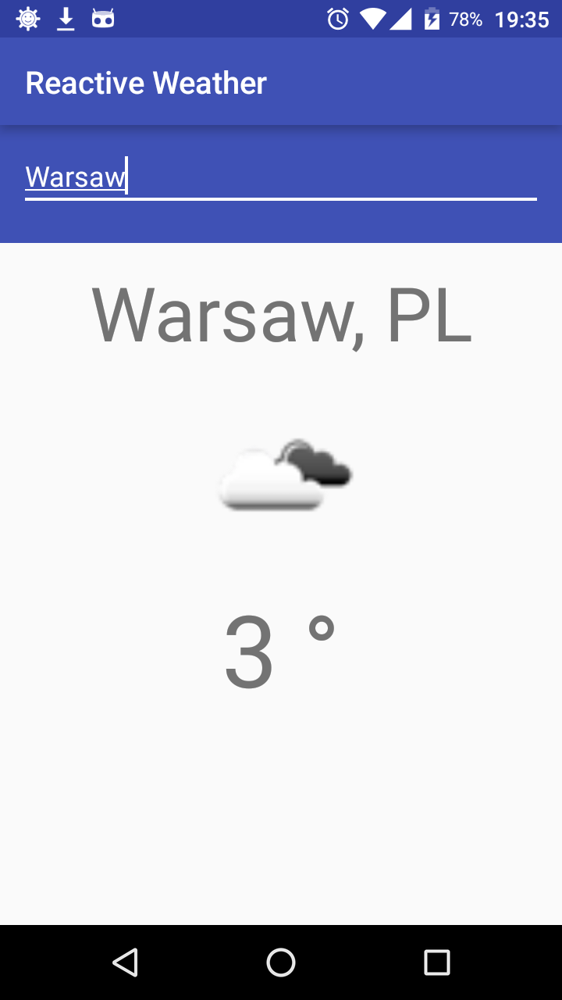

# ReactiveWeather

This app demonstrates comparison between two code styles - standard programming and MVP pattern. Project serves for educational purposes only and will be used for later improvements.

# App in action

App presents simple weather forecast client. When user types city's name it displays current weather type (image) and temperature.



# Libraries used

By app itself:

* Support Library
* ButterKnife
* Retrofit
* RxJavaCallAdapter (for Retrofit)
* RxJava/RxAndroid
* Glide

By unit tests (MVP only):

* Mockito
* Roboletric

# Prerequisites

The project uses OpenWeatherMap API (http://openweathermap.org/) for REST calls. Due to their restrictions the API calls should be invoked with API key. Key could be obtained with simple signing up on their site (don't worry, it's completely free!) and it will be available in user's profile. My project won't be working without key because it's stored in `local.properties`. When user already has a key then just put into `local.properties` this line - `weatherApiKey=YOUR_API_KEY`. It's not necessary to use quotation marks inside `YOUR_API_KEY`.

# Standard architecture

The `app` directory showcases standard coding style in Android. Project contains few layout files and classes. `data.weather` package contains models designed in particular for OpenWeatherMap API. `OpenWeatherApi` serves as interface for incoming REST calls. `MainActivity` represents page and it's responsible for handling input events, processing business logic (REST calls) and displaying retrieved data from external service. 

Main disadvantage of this approach is being untestable with unit tests (so I wasn't bothered with writing them) and behaving like 'god object' (doing too much). For such simple project it's not necessary but in bigger projects with huge amount of activities and fragments would generate extreme boilerplate code and maintainability is decreased.

# MVP architecture

The `app-mvp` directory showcases improved project using MVP pattern. Model layer remains the same but `MainActivity` is separated into `MainView` and `MainPresenter`. Now activity is responsible only for delegating input events into own presenter and also displaying data. Presenter handles API calls and formats response to suitable form for view. It doesn’t need to be coupled with `MainActivity` and it could be anything implementing `MainView` interface.

`BaseActivity` is basic logic for managing presenter’s lifecycle so it’s reused by derived activities. `PresenterCache` stores current presenter while configuration change is happening. After activity recreation presenter is restored from `savedInstanceState`. It’s really handy when presenter is doing heavy background work and restarting it would have big impact on app performance and user time. Unit tests could be written easily because logic and views are decoupled and can be mocked. `MainPresenterTest` simply test presenter’s interaction with view and model. 

## License

```
Licensed under the Apache License, Version 2.0 (the "License");
you may not use this file except in compliance with the License.
You may obtain a copy of the License at

   http://www.apache.org/licenses/LICENSE-2.0

Unless required by applicable law or agreed to in writing, software
distributed under the License is distributed on an "AS IS" BASIS,
WITHOUT WARRANTIES OR CONDITIONS OF ANY KIND, either express or implied.
See the License for the specific language governing permissions and
limitations under the License.
```
